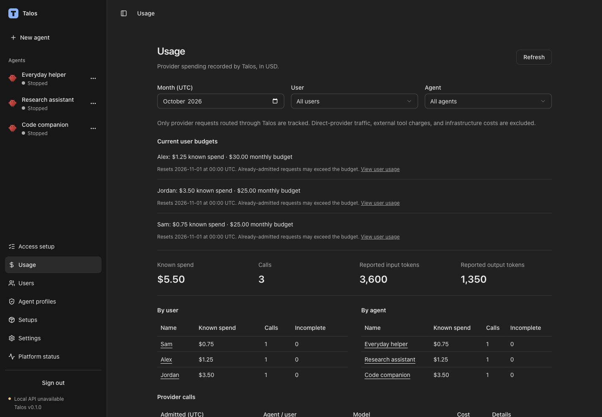
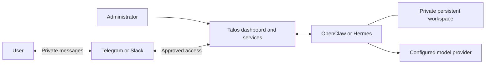

# Talos

**AI agents, managed on your infrastructure.**

Talos is a self-hosted platform for managing AI agents, their tools, access, and usage.
Run agents powered by [OpenClaw](https://github.com/openclaw/openclaw) and
[Hermes](https://github.com/NousResearch/hermes-agent). Configure agent profiles,
connections, and Talos-routed model spending from one dashboard. Users work with
their assigned agents through approved Telegram or Slack accounts.

[Get started](#get-started) · [First agent](#your-first-agent) ·
[Documentation](#documentation) · [Development](#development) ·
[Status and limits](#status-and-limits)



*The Talos Usage screen with synthetic demonstration data. Amounts shown are illustrative.*

## What you can do

| Capability | How it helps |
| --- | --- |
| **Run OpenClaw or Hermes** | Choose an approved runtime version. Each agent has its own container and persistent workspace. |
| **Manage users and agent profiles** | Select native tools and apply permission changes explicitly to the user's agent. |
| **Connect Telegram and Slack** | Invite and approve user identities, revoke access, and verify conversation delivery. |
| **Reuse agent setups** | Publish versioned instructions, skills, and MCP connectors, then apply them through profiles. |
| **Manage models and spending** | Share an OpenRouter key without copying it into agents; report Talos-routed usage and set user monthly budgets. |
| **Inspect availability and recovery** | Track asynchronous operations, expiring health evidence, and uncertain deliveries that require review. |

## How it works



Talos manages assignment, configuration, access, and lifecycle. OpenClaw and Hermes
run the conversations and tools. The dashboard and native interfaces serve
administration and testing; users chat through their approved messaging channel.
Only inference routed through the Talos gateway contributes to its spending ledger
and budget checks.

## Get started

**Current stage: development preview, with a gated preview release pipeline.**
Use the source path below to run the project today. Prebuilt installation requires
a promoted release; candidate artifacts are not installable releases.

### Run from source

You need Git, Python 3 to read the runtime pin, and Docker Engine
with Compose on Linux or Docker Desktop for development. While the repository
remains private, cloning still requires repository access. Source builds use public
upstream dependencies and do not require access to Talos GHCR packages.
Each agent has a 2 GiB
memory limit; allow additional memory and disk space for the platform and images.

```sh
git clone https://github.com/JaviChulvi/talos.git
cd talos
cp .env.example .env
```

Set a unique `POSTGRES_PASSWORD` in `.env` **before the first startup**, then run:

```sh
docker pull "$(python3 -c 'import json; print(json.load(open("deploy/runtimes/openclaw.json"))["image"])')"
docker compose build native-runtime hermes-runtime
docker compose up --build -d
docker compose ps
docker compose exec api python -m backend.app.auth bootstrap
```

Once migrations and services are healthy, open [localhost:8000](http://127.0.0.1:8000)
and sign in with the administrator password. Creating a runtime needs no model key;
answering a conversation requires a configured provider.

See [source setup](docs/development.md#run-locally) for remote-host tunnels, native
interfaces, and runtime credentials. If startup fails, use
[troubleshooting](docs/operations.md#troubleshooting).

### Install a promoted preview release

The release installer targets Ubuntu 24.04 x86_64 with local rootful Docker Engine
and Apple Silicon macOS with local Docker Desktop. It requires at least 4 CPUs,
8 GB RAM and 30 GiB free disk. Public release assets and public images require no
registry credentials; private previews require access.

When a promoted version is available in [Releases](https://github.com/JaviChulvi/talos/releases),
follow [Installation and recovery](docs/installation.md). That guide covers
prebuilt installation, HTTPS, encrypted backups, restore, and platform updates.
Publication requires successful native-host acceptance for the exact release bundle.

## Your first agent

Open **Access setup** in the dashboard to follow saved progress through these steps:

1. **Connect a model.** Save and verify an OpenRouter key, then choose OpenRouter
   and a model for the agent. Alternatively, configure a provider in its native interface.
2. **Create an agent profile and user.** Select the tools the profile needs, create the
   user, and assign that profile. Optionally set a monthly budget for Talos-routed usage.
3. **Create and start the agent.** Choose the user, OpenClaw or Hermes, and an
   approved version. Wait for creation to finish, then start it. First start applies
   the profile; later profile edits require **Apply saved profile**.
4. **Approve channel access.** In **Access & availability**, configure Telegram or
   Slack, check and enable the channel, then invite and approve the user's identity.
5. **Verify a conversation.** Use **Verify delivery**, have the user send the
   verification message and then a normal message, and confirm the full reply was
   accepted by the channel provider.

A ready container alone does not confirm a working user conversation.
[User access](docs/administration.md#user-and-profile-administration) explains
channel credentials, invitations, revocation, and delivery evidence.

## Status and limits

Talos currently uses a single shared workspace with a single built-in administrator and
trusted host operators. The bundled runtime catalog contains OpenClaw **2026.9.6**
and Hermes **0.21.5**; it does not automatically follow upstream releases.

- **Isolation:** agents have separate containers, internal networks, and state
  volumes, but share the host kernel. This is not hostile-tenant isolation. Native
  terminal tools can access files and networks beyond dedicated tool permissions.
- **Access:** user access is through approved private Telegram/Slack identities.
  User website access and an approval broker for sensitive tool actions remain
  outside the current implementation.
- **Spending:** direct-provider traffic, external tools, and infrastructure costs
  are excluded. Concurrent calls and unknown costs mean budgets are not a
  guaranteed maximum provider bill.
- **Recovery:** uncertain work and delivery require reconciliation; Talos does not
  blindly resend them. Stopping or cancelling cannot undo completed external actions.
- **Release readiness:** local and fixture tests do not establish clean-host
  installation support. Release promotion requires native-host acceptance; platform
  updates do not migrate native runtime memory across versions.

See [runtime boundaries](docs/runtimes.md#native-tools-and-connectivity),
[administrator authentication](docs/administration.md#administrator-setup-login-and-recovery),
and [reliability evidence and remaining work](docs/development.md#repeatable-native-runtime-reliability-proof).

## Documentation

| I want to… | Guide |
| --- | --- |
| Install, back up, restore, or update a release | [Installation and recovery](docs/installation.md) |
| Build from source or run checks | [Development and validation](docs/development.md) |
| Choose runtime versions and understand connectivity | [Runtimes and native tools](docs/runtimes.md) |
| Manage administrator login, profiles, and user channels | [Administration and user access](docs/administration.md) |
| Configure providers, inspect usage, and set budgets | [Models and spending](docs/models-and-spending.md) |
| Capture and publish reusable skills and connectors | [Agent setups](docs/setups.md) |
| Inspect API operations or troubleshoot failures | [Operations and troubleshooting](docs/operations.md) |

## Development

The stack is React/TypeScript, FastAPI/Python 3.13, PostgreSQL 17, and Docker Compose.
Host development uses uv 0.11.21, Node.js 22.13 or later, and pnpm 11.19.0.

```sh
uv sync --locked
uv run ruff check .
uv run ruff format --check .
uv run pytest -m 'not integration'
pnpm --dir frontend install --frozen-lockfile
pnpm --dir frontend lint
pnpm --dir frontend typecheck
pnpm --dir frontend test
pnpm --dir frontend build
```

See [Development and validation](docs/development.md) for the repository layout,
hot reload, PostgreSQL/Docker integration checks, and runtime reliability suite.
The three GitHub Actions workflows build release candidates, run installation
acceptance, and promote verified bundles; they are manually dispatched.

## Acknowledgments

Talos integrates [OpenClaw](https://github.com/openclaw/openclaw) and
[Hermes Agent](https://github.com/NousResearch/hermes-agent). Runtime names and icons
identify their respective projects; the bundled [OpenClaw](frontend/public/runtime-icons/LICENSE.openclaw)
and [Hermes](frontend/public/runtime-icons/LICENSE.hermes) icons retain their upstream
MIT licenses. Model-provider logos use [Lobe Icons](https://github.com/lobehub/lobe-icons)
with their [bundled license](frontend/public/lab-icons/LICENSE.txt).

## License

Talos original code is licensed under [Apache-2.0](LICENSE). Copyright 2026
Javier Chulvi Bernad. Third-party runtimes, dependencies, and assets retain their
own licenses; see [Third-party notices](THIRD_PARTY_NOTICES.md).

## Contributing and security

See [Contributing](CONTRIBUTING.md) for development and PR checks, and
[Security policy](SECURITY.md) for trust boundaries and private reporting.
